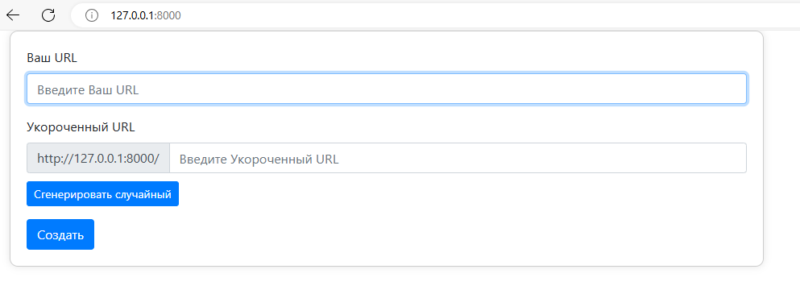

## URL Shortener

Технологии

- Используйте Django как основной веб-фреймворк
- Для генерации случайных идентификаторов random
- Простой фронтенд, использование только HTML будет достаточно
- Так же может понадобится urllib для парсинга и валидации URL'ов

##

Эндпоинты:

1) Главная страница, **path**:  - <your_domain>/



- Вводится ссылка, которую нужно преобразовать (например urban-university.ru/profile/course?alias=course999421818026)
- Пользователю дается возможность самому придумать URL на Вашем сайте, при переходе на который будет перенаправление по
  изначальной ссылке, либо сгенерировать случайный (например <your_domain>/awesome_url)


- Для того, чтобы ссылка на Вашем сайте была доступна всегда, нужно создать таблицу в бд, которая будет связывать URL
  изначальный и придуманный пользователем


- Так же, если пользователь пытается создать ссылку с идентификатором, который уже занят, то Ваш сайт уведомляет
  пользователя об этом


2) Страница с перенаправлениями, **path**: <your_domain>/<str:unique_identifier>

- При переходе на эту страницу происходит проверка соответствия уникального идентификатора какому-то URL в базе данных
  (*Обратите внимание, что при использовании функции*  ```redirect``` *из модуля Django важно указан ли
  префикс ```https/http```  или его нет, от этого зависит будет ли перенаправление
  по [абсолютной ссылке или относительной](https://stackforgeeks.com/blog/django-url-redirect)*)
- При отсутсвии соответсвующего *unique_identifier* в бд отрисовыват страницу с ошибкой 404 и изначальный URL для
  перенаправления
  
- Если запись в бд есть, то перенаправляет на нее


<p style="text-align: center;">&#8595; &#8595; &#8595;</p>


##

**Задание под звездочкой*:
Контролировать время жизни ссылки, чтобы URL по истечению месяца удалялись из бд (*Можете
воспользоваться [signals](https://docs.djangoproject.com/en/5.0/topics/signals/)*)*
